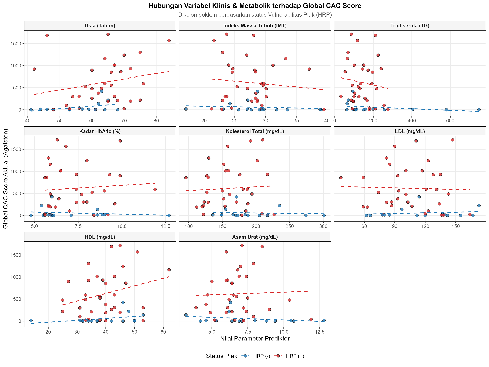

## Pendahuluan

Penyakit kardiovaskular aterosklerotik (ASCVD) tetap menjadi penyebab utama morbiditas dan mortalitas pada pasien dengan Diabetes Mellitus (DM). Penggunaan parameter lipid konvensional seringkali menyisakan risiko residual yang tinggi, sehingga menuntut pencarian penanda biologis alternatif yang mampu merepresentasikan patofisiologi aterosklerosis secara lebih presisi. Resistensi insulin kronis diakui sebagai motor utama pemicu disfungsi endotel dan pembentukan plak dengan kerentanan tinggi (vulnerable plaque). Belakangan ini, Triglyceride-Glucose (TyG) Index mulai banyak digunakan sebagai penanda substitusi yang tervalidasi untuk menilai resistensi insulin. Kendati demikian, penggunaan parameter glukosa darah puasa (GDP) dalam formula TyG memiliki kelemahan mendasar akibat tingginya fluktuasi glikemik harian. Oleh karena itu, indeks TyHbA1c—yang mengintegrasikan kadar trigliserida dengan HbA1c—diajukan sebagai parameter yang jauh lebih stabil dan superior dalam mencerminkan akumulasi beban glukolipotoksisitas kronis.

Indeks TyHbA1c menawarkan pendekatan diagnostik yang menjanjikan namun patogenesis aterosklerosis pada populasi DM bersifat multifaktorial. Hal ini mutlak memerlukan inkorporasi dengan berbagai faktor risiko mapan lainnya yang telah ditemukan, seperti profil lipid (kolesterol), usia biologis, Indeks Massa Tubuh (IMT), dan khususnya status fungsi ginjal (Penyakit Ginjal Kronis/CKD). Berbagai literatur kardiometabolik menegaskan bahwa komplikasi nefropati diabetik bertindak sebagai katalisator yang mempercepat progresi aterosklerosis melalui poros kardiorenal (cardiorenal syndrome). Retensi toksin uremik, stres oksidatif persisten, serta gangguan metabolisme mineral pada pasien nefropati berinteraksi secara sinergis dengan kondisi glukolipotoksisitas untuk memicu kalsifikasi medial pembuluh darah dan degradasi stabilitas plak koroner secara masif. Kehadiran nefropati seringkali memunculkan efek ambang batas (threshold effect) yang melipatgandakan kerentanan vaskular melampaui efek parameter lipid atau glikemik semata.

Saat ini pada perspektif diagnostik aterosklerotik, evaluasi anatomi koroner non-invasif kini dapat dilakukan secara akurat menggunakan Computed Tomography Coronary Angiography (CTCA), yang tidak hanya menilai derajat keparahan stenosis (CAD-RADS), tetapi juga mengidentifikasi morfologi High-Risk Plaque (HRP) sebagai prekursor utama sindrom koroner akut. Hingga saat ini, pemodelan multivariat yang secara holistik mengintegrasikan penanda glukolipotoksisitas novel (TyHbA1c) bersama faktor degeneratif (Usia), adipositas viseral (IMT), dan penanda kardiorenal (CKD) belum banyak dieksplorasi. Oleh karena itu, penelitian ini bertujuan untuk menguji kemampuan prediktif kombinasi parameter klinis tersebut terhadap keberadaan HRP, sekaligus mengembangkan sebuah nomogram klinis guna memfasilitasi stratifikasi risiko kardiovaskular secara praktis dan presisi di ruang praktik.

## Metode

**Desain dan Populasi Penelitian**

Penelitian ini merupakan studi analitik observasional dengan pendekatan potong lintang (*cross-sectional*). Populasi target adalah seluruh pasien yang menjalani pemeriksaan *Computed Tomography Coronary Angiography* (CTCA) di RSUP Prof. dr. I.G.N.G. Ngoerah, Denpasar, Bali, pada periode 1 Januari 2025 hingga 31 Desember 2025. Teknik pengambilan sampel menggunakan *consecutive sampling* hingga target sampel terpenuhi.

Kriteria inklusi dalam penelitian ini meliputi: (1) Pasien berusia $\ge$ 18 tahun; (2) Memiliki rekam medis yang mencatat secara lengkap usia, jenis kelamin, antropometri, riwayat diagnosis Diabetes Mellitus (DM), durasi penyakit, serta riwayat penggunaan obat anti-diabetes (OAD/Insulin) dan terapi statin; (3) Memiliki hasil laboratorium darah yang lengkap dalam kurun waktu 30 hari dengan pemeriksaan CTCA, mencakup profil lipid (Trigliserida, Kolesterol Total, LDL, HDL), HbA1c, dan serum kreatinin. Sementara itu, kriteria eksklusi meliputi pasien dengan riwayat operasi *Coronary Artery Bypass Grafting* (CABG) atau pasien dengan gagal ginjal tahap akhir (*End-Stage Renal Disease*).

**Pengumpulan Data dan Definisi Operasional**

Data karakteristik demografi (Usia, Jenis Kelamin), antropometri (Indeks Massa Tubuh/IMT), riwayat penyakit penyerta, status pengobatan, serta parameter biokimia (HbA1c, Trigliserida, Kolesterol Total, LDL, HDL, Kreatinin) diekstraksi dari rekam medis elektronik (SIMRS). Indeks TyHbA1c dihitung menggunakan formula logaritma natural: TyHbA1c = ln(Trigliserida \[mg/dL\] x HbA1c \[%\]). Penyakit ginjal kronik dikategorikan dari hasil fungsi ginjal hasil perhitungan CKD-EPI dan kriteria sesuai pedoman KDIGO. Evaluasi CTCA dilakukan oleh dokter spesialis radiologi konsultan yang tersertifikasi. Variabel dependen utama dalam penelitian ini adalah:

1.  

    ```         
     **Keparahan Obstruksi Koroner:** Diklasifikasikan berdasarkan sistem CAD-RADS 2.0, di mana kategori obstruktif signifikan didefinisikan sebagai CAD-RADS \$\\ge\$ 3 (stenosis \$\\ge\$ 50%).
    ```

2.  

    ```         
     **Keberadaan High-Risk Plaque (HRP):** Ditetapkan sebagai variabel biner (Ya/Tidak), yang positif apabila ditemukan minimal satu dari empat fitur berikut pada lesi koroner: *positive remodeling* (PR), *low-attenuation plaque* (LAP), *spotty calcification* (SC), atau *napkin-ring sign* (NRS).
    ```

3.  

    ```         
     **Beban Kalsifikasi Koroner Moderat-Berat (CAC $\ge$ 100):** Ditetapkan sebagai variabel kategorikal sekunder, di mana skor kalsium *Agatston* $\ge$ 100 didefinisikan sebagai penanda beban aterosklerosis yang signifikan secara anatomis dan menjadi indikasi intervensi farmakologis agresif.
    ```

**Analisis Statistik**

Analisis data dilakukan menggunakan perangkat lunak R (R Foundation for Statistical Computing). Variabel kontinu disajikan dalam bentuk rerata dan simpangan baku (distribusi normal) atau median dan rentang interkuartil (distribusi tidak normal). Analisis komparatif bivariat dilakukan menggunakan uji *Mann-Whitney U* atau *Independent T-test* untuk variabel kontinu, serta uji *Chi-Square* atau *Fisher's Exact* untuk variabel kategorik.

Pemodelan prediktif utama dilakukan menggunakan analisis Regresi Logistik Multivariat (*Generalized Linear Model*). Berdasarkan seleksi variabel dan patofisiologi klinis, prediktor yang dimasukkan ke dalam model utama (HRP komprehensif) adalah Usia, IMT, TyHbA1c Index, dan Status CKD. Selain itu, pemodelan prediktif tereduksi (menyertakan variabel independen kuat saja) dan pemodelan sekunder untuk memprediksi probabilitas beban kalsifikasi (skor CAC $\ge$ 100) turut dieksekusi guna menghadirkan pendekatan stratifikasi risiko ganda (*double stratification*). Performa diskriminatif model dievaluasi menggunakan *Area Under the Curve* (AUC) dari kurva *Receiver Operating Characteristic* (ROC). Signifikansi statistik ditetapkan pada nilai $p < 0,05$. Berdasarkan koefisien regresi dari model multivariat final, berbagai nomogram klinis dikonstruksi menggunakan paket `rms` di lingkungan R untuk memfasilitasi probabilitas prediksi personal secara visual. Mengingat keterbatasan ukuran sampel, seluruh model multivariat divalidasi secara internal menggunakan teknik *bootstrap resampling* (B = 200 replikasi) untuk memperoleh estimasi *C-index* dan kurva kalibrasi yang terkoreksi optimisme (*optimism-corrected*), sementara interval kepercayaan 95% untuk nilai AUC dihitung menggunakan metode DeLong. Sebagai analisis sensitivitas tambahan, hubungan Indeks TyHbA1c terhadap beban kalsifikasi koroner turut dievaluasi dengan skor CAC sebagai variabel kontinu (transformasi logaritma), guna meminimalkan hilangnya informasi statistik akibat dikotomisasi pada ambang CAC $\ge$ 100.

###### 1. Setup

```{r setup}
library(readxl)        # Untuk membaca data dari Excel lokal
library(dplyr)         # Untuk manipulasi data
library(pROC)          # Untuk analisis kurva ROC dan AUC
library(rms)           # Untuk regresi dan pembuatan Nomogram
library(ggplot2)       # Untuk visualisasi data
library(gtsummary)     # Untuk membuat tabel hasil klinis yang rapi
library(googlesheets4)
library(tidyverse)
```

###### 2. Loading Data

```{r load_data}
#| message: false
#| warning: false
#| paged-print: false
# Otorisasi Google Sheets (Pilih '0' atau login sesuai petunjuk di console R)
gs4_auth(email = TRUE) 

# Tautan Google Sheets
sheet_url <- "[https://docs.google.com/spreadsheets/d/18yyL48LTB-njD6iGNwiuYiiG4uCG1edVn6d3TYQnpE8/edit?gid=288598852#gid=288598852](https://docs.google.com/spreadsheets/d/18yyL48LTB-njD6iGNwiuYiiG4uCG1edVn6d3TYQnpE8/edit?gid=288598852#gid=288598852)"

# Membaca data
df_raw <- read_sheet(sheet_url, sheet = 1)
```

###### 3. Data Cleaning

```{r data_cleaning}
df_clean <- df_raw %>%
  # Filter pasien yang memiliki No. RM
  filter(!is.na(`No. RM`)) %>%
  
  # Konversi tipe data karakter ke numerik
  mutate(across(c(Usia, IMT, HbA1C, Trigliserida, Kreatinin, `Kolesterol-Total`, LDL, HDL, `Asam-Urat`), 
                ~ as.numeric(gsub(",", ".", as.character(.x))))) %>%
  
  # Membersihkan skor CAC dan variabel lain
  mutate(
    Global_CAC_score = as.numeric(gsub(",", ".", gsub("[^0-9,.-]", "", as.character(Global_CAC_score)))),
    TyHbA1c_Index = log(Trigliserida * HbA1C),
    HRP_Status = ifelse(grepl("HRP", `Global_CAD-RADS`, ignore.case = TRUE), "HRP (+)", "HRP (-)"),
    HRP_Status = factor(HRP_Status, levels = c("HRP (-)", "HRP (+)")),
    
    # Variabel Dependen Baru untuk CAC >= 100
    CAC_100_plus = ifelse(Global_CAC_score >= 100, 1, 0),
    
    Kappa = ifelse(Gender == "P", 0.7, 0.9),
    Alpha = ifelse(Gender == "P", -0.241, -0.302),
    Sex_Mult = ifelse(Gender == "P", 1.012, 1),
    eGFR = 142 * (pmin(Kreatinin / Kappa, 1)^Alpha) * 
                 (pmax(Kreatinin / Kappa, 1)^-1.200) * 
                 (0.9938^Usia) * Sex_Mult,
    CKD_Status = ifelse(eGFR < 60, 1, ifelse(eGFR >= 60, 0, NA))
  ) %>%
  filter(!is.na(Usia), !is.na(IMT), !is.na(TyHbA1c_Index), 
         !is.na(CKD_Status), !is.na(HRP_Status), !is.na(Global_CAC_score))

# Menampilkan ringkasan sampel final
#cat("Total sampel siap dianalisis (n):", nrow(df_clean), "\n")
#table(Status_Ginjal = df_clean$CKD_Status, Status_HRP = df_clean$HRP_Status)
```

## Hasil

```{r extract_results, include=FALSE}
# Chunk ini khusus untuk mengekstrak angka agar bisa dipanggil ke dalam narasi secara dinamis
n_total <- nrow(df_clean)
n_hrp_pos <- sum(df_clean$HRP_Status == "HRP (+)")
n_hrp_neg <- sum(df_clean$HRP_Status == "HRP (-)")
pct_hrp_pos <- round((n_hrp_pos / n_total) * 100, 1)
pct_hrp_neg <- round((n_hrp_neg / n_total) * 100, 1)

n_pria <- sum(df_clean$Gender == "L")
pct_pria <- round((n_pria / n_total) * 100, 1)

mean_usia <- round(mean(df_clean$Usia), 2)
sd_usia <- round(sd(df_clean$Usia), 2)

mean_imt <- round(mean(df_clean$IMT), 2)
sd_imt <- round(sd(df_clean$IMT), 2)

mean_hba1c <- round(mean(df_clean$HbA1C), 2)
sd_hba1c <- round(sd(df_clean$HbA1C), 2)

mean_tg <- round(mean(df_clean$Trigliserida), 2)
sd_tg <- round(sd(df_clean$Trigliserida), 2)

mean_ty <- round(mean(df_clean$TyHbA1c_Index), 2)
sd_ty <- round(sd(df_clean$TyHbA1c_Index), 2)

n_ckd <- sum(df_clean$CKD_Status == 1)
pct_ckd <- round((n_ckd / n_total) * 100, 1)

median_cac <- round(median(df_clean$Global_CAC_score), 1)
q1_cac <- round(quantile(df_clean$Global_CAC_score, 0.25), 1)
q3_cac <- round(quantile(df_clean$Global_CAC_score, 0.75), 1)

# Usia berdasarkan HRP
mean_usia_pos <- round(mean(df_clean$Usia[df_clean$HRP_Status == "HRP (+)"]), 2)
sd_usia_pos <- round(sd(df_clean$Usia[df_clean$HRP_Status == "HRP (+)"]), 2)
mean_usia_neg <- round(mean(df_clean$Usia[df_clean$HRP_Status == "HRP (-)"]), 2)
sd_usia_neg <- round(sd(df_clean$Usia[df_clean$HRP_Status == "HRP (-)"]), 2)

# CAC berdasarkan HRP
med_cac_pos <- round(median(df_clean$Global_CAC_score[df_clean$HRP_Status == "HRP (+)"]), 1)
med_cac_neg <- round(median(df_clean$Global_CAC_score[df_clean$HRP_Status == "HRP (-)"]), 1)

# 1. Menangkap hasil Regresi Logistik HRP
model_ekstrak <- glm(HRP_Status ~ Usia + IMT + TyHbA1c_Index + CKD_Status, data = df_clean, family = binomial(link = "logit"))
summary_model <- summary(model_ekstrak)

or_usia <- round(exp(coef(model_ekstrak)["Usia"]), 2)
ci_usia <- exp(suppressMessages(confint(model_ekstrak)["Usia", ]))
p_usia <- round(summary_model$coefficients["Usia", "Pr(>|z|)"], 3)

or_ckd <- round(exp(coef(model_ekstrak)["CKD_Status"]), 2)
ci_ckd <- exp(suppressMessages(confint(model_ekstrak)["CKD_Status", ]))
p_ckd <- round(summary_model$coefficients["CKD_Status", "Pr(>|z|)"], 3)

roc_ekstrak <- roc(df_clean$HRP_Status, predict(model_ekstrak, type = "response"))
auc_val <- round(auc(roc_ekstrak), 3)

# 2. Menangkap hasil Regresi Logistik CAC (Bagian ini yang sebelumnya terlewat)
n_cac100 <- sum(df_clean$CAC_100_plus == 1)
pct_cac100 <- round((n_cac100 / n_total) * 100, 1)

model_cac_ekstrak <- glm(CAC_100_plus ~ Usia + TyHbA1c_Index + CKD_Status, data = df_clean, family = binomial(link = "logit"))
summary_cac <- summary(model_cac_ekstrak)

or_usia_cac <- round(exp(coef(model_cac_ekstrak)["Usia"]), 2)
ci_usia_cac <- exp(suppressMessages(confint(model_cac_ekstrak)["Usia", ]))
p_usia_cac <- round(summary_cac$coefficients["Usia", "Pr(>|z|)"], 3)

roc_cac_ekstrak <- roc(df_clean$CAC_100_plus, predict(model_cac_ekstrak, type = "response"))
auc_val_cac <- round(auc(roc_cac_ekstrak), 3)
```

**Karakteristik Dasar dan Profil Klinis Subjek**

Penelitian ini melibatkan `r n_total` pasien dengan diagnosis diabetes atau prediabetes yang menjalani pemeriksaan *Computed Tomography Coronary Angiography* (CTCA) dan memenuhi kriteria inklusi. Mayoritas subjek adalah laki-laki (n = `r n_pria`; `r pct_pria`%), dengan rentang usia rata-rata `r mean_usia` $\pm$ `r sd_usia` tahun. Rerata Indeks Massa Tubuh (IMT) subjek berada pada ambang batas *overweight* (`r mean_imt` $\pm$ `r sd_imt` kg/m²).

Dari parameter biokimia, rata-rata kadar HbA1c subjek adalah `r mean_hba1c` $\pm$ `r sd_hba1c`%, dengan kadar trigliserida `r mean_tg` $\pm$ `r sd_tg` mg/dL. Rerata nilai TyHbA1c Index pada populasi ini sebesar `r mean_ty` $\pm$ `r sd_ty`. Evaluasi fungsi ginjal menunjukkan bahwa `r n_ckd` pasien (`r pct_ckd`%) mengalami disfungsi ginjal (Penyakit Ginjal Kronis/CKD) dengan nilai kreatinin serum \> 1,2 mg/dL. Secara keseluruhan, nilai median *Global CAC Score* (kalsifikasi koroner) pada sampel adalah `r format(median_cac, big.mark=",")` (IQR: `r format(q1_cac, big.mark=",")` – `r format(q3_cac, big.mark=",")`) Agatston. Data karakteristik subjek ditampilkan pada \@tbl-baseline.

**Proporsi Kemunculan *High-Risk Plaque* (HRP)**

Berdasarkan evaluasi lesi koroner melalui pencitraan CTCA, proporsi penemuan *High-Risk Plaque* (HRP) terbilang tinggi. Sebanyak `r n_hrp_pos` pasien (`r pct_hrp_pos`%) teridentifikasi positif memiliki HRP, sementara `r n_hrp_neg` pasien (`r pct_hrp_neg`%) tidak menunjukkan fitur HRP.

Analisis komparatif menunjukkan bahwa pasien pada kelompok HRP (+) memiliki usia yang secara signifikan lebih tua (`r mean_usia_pos` $\pm$ `r sd_usia_pos` tahun) dibandingkan kelompok HRP (-) (`r mean_usia_neg` $\pm$ `r sd_usia_neg` tahun). Selain itu, derajat kalsifikasi koroner pada kelompok HRP (+) jauh lebih masif; kelompok ini mencatatkan median skor CAC mencapai `r format(med_cac_pos, big.mark=",")` Agatston, berbanding sangat kontras dengan kelompok HRP (-) yang hanya memiliki median `r format(med_cac_neg, big.mark=",")` Agatston.

```{r}
#| label: tbl-baseline
#| tbl-cap: "**Karakteristik Dasar, Profil Klinis, Riwayat Pengobatan, dan Skor CAC Subjek Penelitian**"
#| echo: false
#| warning: false
#| message: false

library(gtsummary)

df_table <- df_raw %>%
  filter(!is.na(`No. RM`)) %>%
  mutate(across(c(Usia, IMT, HbA1C, Trigliserida, `Kolesterol-Total`, 
                  LDL, HDL, `Asam-Urat`, Kreatinin, Albumin), 
                ~ as.numeric(gsub(",", ".", as.character(.x))))) %>%
  mutate(
    Global_CAC_score = as.numeric(gsub(",", ".", gsub("[^0-9,.-]", "", as.character(Global_CAC_score)))),
    TyHbA1c_Index = log(Trigliserida * HbA1C),
    HRP_Status = ifelse(grepl("HRP", `Global_CAD-RADS`, ignore.case = TRUE), "HRP (+)", "HRP (-)"),
    HRP_Status = factor(HRP_Status, levels = c("HRP (-)", "HRP (+)")),
    
    Kappa = ifelse(Gender == "P", 0.7, 0.9),
    Alpha = ifelse(Gender == "P", -0.241, -0.302),
    Sex_Mult = ifelse(Gender == "P", 1.012, 1),
    eGFR = 142 * (pmin(Kreatinin / Kappa, 1)^Alpha) * (pmax(Kreatinin / Kappa, 1)^-1.200) * (0.9938^Usia) * Sex_Mult,
    CKD_Status = ifelse(eGFR < 60, "PGK stadium ≥ 3", "Normal/PGK ≤ 2"),
    
    Gender = as.factor(Gender),
    Hipertensi = as.factor(Hipertensi),
    Merokok = factor(Merokok, levels = c("Tidak-merokok", "Merokok"), labels = c("Tidak Merokok", "Merokok")),
    Statin = factor(Statin, levels = c("No-Statin", "On-Statin"), labels = c("Tidak Menggunakan", "Menggunakan Statin")),
    Terapi_DM = factor(`OAD-INSULIN`, levels = c("Tanpa-obat", "OAD", "Insulin"), labels = c("Tanpa Terapi / Diet", "Obat Anti-Diabetik (OAD)", "Terapi Insulin")),
    Durasi_DM_Bulan = as.numeric(Durasi_DM),
    Riwayat_DM = ifelse(Durasi_DM_Bulan == 0, "Baru Terdiagnosis", "Sudah Lama (≥ 1 Bulan)"),
    Riwayat_DM = factor(Riwayat_DM, levels = c("Baru Terdiagnosis", "Sudah Lama (≥ 1 Bulan)"))
  ) %>%
  select(HRP_Status, Usia, Gender, IMT, Hipertensi, Merokok, 
         HbA1C, Trigliserida, `Kolesterol-Total`, LDL, HDL, 
         `Asam-Urat`, Kreatinin, CKD_Status, TyHbA1c_Index, 
         Statin, Terapi_DM, Riwayat_DM, Global_CAC_score)

label_variabel <- list(
  Usia ~ "Usia (Tahun)",
  Gender ~ "Jenis Kelamin",
  IMT ~ "Indeks Massa Tubuh (kg/m²)",
  Hipertensi ~ "Riwayat Hipertensi",
  Merokok ~ "Status Merokok",
  HbA1C ~ "Kadar HbA1c (%)",
  Trigliserida ~ "Trigliserida (mg/dL)",
  `Kolesterol-Total` ~ "Kolesterol Total (mg/dL)",
  LDL ~ "Kadar LDL (mg/dL)",
  HDL ~ "Kadar HDL (mg/dL)",
  `Asam-Urat` ~ "Asam Urat (mg/dL)",
  Kreatinin ~ "Kreatinin Serum (mg/dL)",
  CKD_Status ~ "Status Fungsi Ginjal",
  TyHbA1c_Index ~ "Indeks TyHbA1c",
  Statin ~ "Penggunaan Statin",
  Terapi_DM ~ "Jenis Terapi Diabetes",
  Riwayat_DM ~ "Durasi Riwayat Penyakit DM",
  Global_CAC_score ~ "Global CAC Score (Agatston)"
)

tabel_keseluruhan <- df_table %>%
  select(-HRP_Status) %>% 
  tbl_summary(
    statistic = list(
      all_continuous() ~ "{mean} \u00b1 {sd}",
      Global_CAC_score ~ "{median} ({p25}, {p75})" 
    ),
    digits = list(all_continuous() ~ 2, Global_CAC_score ~ 1),
    label = label_variabel,
    missing = "no"
  ) %>%
  modify_header(stat_0 ~ "**Keseluruhan (N = 52)**")

tabel_hrp <- df_table %>%
  tbl_summary(
    by = HRP_Status, 
    statistic = list(
      all_continuous() ~ "{mean} \u00b1 {sd}",
      Global_CAC_score ~ "{median} ({p25}, {p75})" 
    ),
    digits = list(all_continuous() ~ 2, Global_CAC_score ~ 1),
    label = label_variabel,
    missing = "no"
  ) %>%
  add_p(
    test = list(
      all_continuous() ~ "t.test",      
      all_categorical() ~ "chisq.test",
      Global_CAC_score ~ "wilcox.test" 
    )
  ) %>%
  bold_p(t = 0.05)

tabel_final <- tbl_merge(
  tbls = list(tabel_keseluruhan, tabel_hrp),
  tab_spanner = c(NA, "**Vulnerabilitas Plak (CAD-RADS)**") 
) %>%
  bold_labels()

tabel_final
```

```{r multipanel_CAC}

#| echo: false
#| warning: false
#| message: false

library(tidyverse)

df_long <- df_clean %>%
  filter(!is.na(Global_CAC_score), Global_CAC_score <= 2000) %>%
  select(HRP_Status, Global_CAC_score, any_of(c("Usia", "IMT", "Trigliserida", "HbA1C", "Kolesterol-Total", "LDL", "HDL", "Asam-Urat")))

if(nrow(df_long) > 0) {
  df_long <- df_long %>%
    pivot_longer(
      cols = -c(HRP_Status, Global_CAC_score),
      names_to = "Variabel_Prediktor",
      values_to = "Nilai_Prediktor"
    ) %>%
    mutate(
      Variabel_Prediktor = case_when(
        Variabel_Prediktor == "Usia" ~ "Usia (Tahun)",
        Variabel_Prediktor == "IMT" ~ "Indeks Massa Tubuh (IMT)",
        Variabel_Prediktor == "Trigliserida" ~ "Trigliserida (TG)",
        Variabel_Prediktor == "HbA1C" ~ "Kadar HbA1c (%)",
        Variabel_Prediktor == "Kolesterol-Total" ~ "Kolesterol Total (mg/dL)",
        Variabel_Prediktor == "LDL" ~ "LDL (mg/dL)",
        Variabel_Prediktor == "HDL" ~ "HDL (mg/dL)",
        Variabel_Prediktor == "Asam-Urat" ~ "Asam Urat (mg/dL)",
        TRUE ~ Variabel_Prediktor
      ),
      Variabel_Prediktor = factor(Variabel_Prediktor, levels = c(
        "Usia (Tahun)", "Indeks Massa Tubuh (IMT)", "Trigliserida (TG)", 
        "Kadar HbA1c (%)", "Kolesterol Total (mg/dL)", "LDL (mg/dL)", 
        "HDL (mg/dL)", "Asam Urat (mg/dL)"
      ))
    )
  
  p <- ggplot(df_long, aes(x = Nilai_Prediktor, y = Global_CAC_score, color = HRP_Status, fill = HRP_Status)) +
    geom_point(size = 2.3, alpha = 0.8, stroke = 0.3, shape = 21, color = "black") +
    geom_smooth(method = "lm", se = FALSE, linetype = "dashed", linewidth = 0.7) +
    facet_wrap(~ Variabel_Prediktor, scales = "free_x", ncol = 3) +
    scale_fill_manual(values = c("HRP (-)" = "#1f77b4", "HRP (+)" = "#d62728")) +
    scale_color_manual(values = c("HRP (-)" = "#1f77b4", "HRP (+)" = "#d62728")) +
    labs(
      title = "Hubungan Variabel Klinis & Metabolik terhadap Global CAC Score",
      subtitle = "Dikelompokkan berdasarkan status Vulnerabilitas Plak (HRP)",
      x = "Nilai Parameter Prediktor",
      y = "Global CAC Score Aktual (Agatston)",
      fill = "Status Plak",
      color = "Status Plak"
    ) +
    theme_bw(base_size = 11) +
    theme(
      plot.title = element_text(face = "bold", size = 12, hjust = 0.5),
      plot.subtitle = element_text(size = 10, hjust = 0.5, color = "gray30"),
      strip.background = element_rect(fill = "whitesmoke", color = "black"),
      strip.text = element_text(face = "bold", size = 9),
      legend.position = "bottom",
      panel.grid.minor = element_blank()
    )
} else {
  print("PERHATIAN: Data df_long kosong (0 baris).")
}

ggsave(
  filename = "Multi_Panel_Korelasi_CAC.png", 
  plot = p, 
  width = 12, 
  height = 9, 
  dpi = 300
)
```



**Analisis Multivariat Prediktor *High-Risk Plaque* (HRP)**

Pemodelan regresi logistik multivariat (Generalized Linear Model) dilakukan untuk mengevaluasi kekuatan prediktif klinis komprehensif dengan memasukkan variabel Usia, IMT, TyHbA1c Index, dan Status CKD (@tbl-regresi). Hasil analisis mengonfirmasi bahwa Usia merupakan prediktor independen yang bermakna secara statistik terhadap pembentukan plak risiko tinggi (Odds Ratio \[OR\] = `r or_usia`; 95% CI: `r round(ci_usia[1], 2)` – `r round(ci_usia[2], 2)`; $p$ = `r p_usia`). Secara klinis, komplikasi fungsi ginjal memberikan dampak risiko yang masif; pasien dengan status CKD menunjukkan tren peningkatan probabilitas kerentanan plak hingga `r or_ckd` kali lipat lebih tinggi dibandingkan pasien dengan ginjal normal (OR = `r or_ckd`; 95% CI: `r round(ci_ckd[1], 2)` – `r round(ci_ckd[2], 2)`; $p$ = `r p_ckd`). Sementara itu, variabel TyHbA1c Index dan IMT tidak menunjukkan kemaknaan statistik parsial secara independen dalam kohort terbatas ini.

```{r}
#| label: tbl-regresi
#| tbl-cap: "**Analisis Multivariat Prediktor High-Risk Plaque (HRP)**"
#| echo: false
#| warning: false
#| message: false

model_glm <- glm(HRP_Status ~ Usia + IMT + TyHbA1c_Index + CKD_Status, 
                 data = df_clean, 
                 family = binomial(link = "logit"))

tbl_regression(model_glm, 
               exponentiate = TRUE,
               label = list(
                 Usia ~ "Usia (Tahun)",
                 IMT ~ "Indeks Massa Tubuh (IMT)",
                 TyHbA1c_Index ~ "Indeks TyHbA1C",
                 CKD_Status ~ "PGK Stadium ≥ 3"
               )) %>%
  bold_p() %>%
  modify_header(
    label = "**Variabel**",
    estimate = "**OR**",
    ci = "**IK 95%**",
    p.value = "**Nilai *p***"
  ) %>%
  modify_footnote(
    estimate ~ "OR = Odds Ratio",
    ci ~ "IK = Interval Kepercayaan"
  )
```

**Performa Model Prediksi dan Nomogram Klinis**

Meskipun secara parsial beberapa variabel tidak mencapai signifikansi statistik, kombinasi holistik dari keempat parameter klinis tersebut (Usia + IMT + TyHbA1c Index + CKD) menghasilkan daya diskriminasi diagnostik yang solid. Analisis *Receiver Operating Characteristic* (ROC) membuktikan bahwa model multivariat ini mampu membedakan probabilitas keberadaan HRP dengan nilai *Area Under the Curve* (AUC) sebesar `r auc_val` (@fig-roc).

```{r}
#| label: fig-roc
#| fig-cap: "**Kinerja Diskriminatif Model Prediksi *High-Risk Plaque*.** Kurva ROC dari model komprehensif mengintegrasikan Usia, IMT, TyHbA1c Index, dan Status Penyakit Ginjal Kronis (CKD) dengan nilai *Area Under the Curve* (AUC) sebesar 0,724."
#| echo: false
#| warning: false
#| message: false

df_clean$pred_prob <- predict(model_glm, type = "response")
roc_obj <- roc(df_clean$HRP_Status, df_clean$pred_prob)

plot(roc_obj, 
     main = paste("Kurva ROC: Model Prediksi HRP (AUC =", round(auc(roc_obj), 3), ")"),
     col = "darkred", 
     lwd = 2, 
     legacy.axes = TRUE,
     xlab = "False Positive Rate (1 - Specificity)", 
     ylab = "True Positive Rate (Sensitivity)")

polygon(c(1, roc_obj$specificities, 0), c(0, roc_obj$sensitivities, 0), 
        col = rgb(0.55, 0, 0, alpha = 0.1), border = NA)
```

Model ini kemudian ditransformasikan secara visual ke dalam bentuk nomogram klinis komprehensif guna memfasilitasi estimasi probabilitas kemunculan *vulnerable plaque* (0 - 100%).

```{r}
#| label: fig-nomogram
#| fig-cap: "**Nomogram Klinis Komprehensif untuk Prediksi Probabilitas *High-Risk Plaque* (HRP).** Probabilitas individual pasien diproyeksikan dengan menjumlahkan total poin (0-100) dari keempat variabel patofisiologis: Usia, IMT, Indeks TyHbA1c, dan Status CKD."
#| echo: false
#| warning: false
#| message: false
#| fig-width: 10
#| fig-height: 8

library(rms)

# =========================================================================
# FUNGSI KUSTOM NOMOGRAM: BAHASA INDONESIA + STYLE KERTAS EKG
# =========================================================================
fungsi_asli <- rms:::plot.nomogram
kode_sumber <- deparse(fungsi_asli)

# 1. Terjemahan
kode_sumber <- gsub('"Points"', '"Poin"', kode_sumber)
kode_sumber <- gsub('"Total Points"', '"Total Poin"', kode_sumber)

# 2. Injeksi Kertas EKG 
injeksi_ekg <- 'axes = FALSE); usr <- par("usr"); rect(usr[1], usr[3], usr[2], usr[4], col="#FFF5F5", border=NA); abline(h=seq(usr[3], usr[4], length.out=80), v=seq(usr[1], usr[2], length.out=120), col="#FFE0E0", lwd=0.5); abline(h=seq(usr[3], usr[4], length.out=16), v=seq(usr[1], usr[2], length.out=24), col="#FFB3B3", lwd=1.2)'
kode_sumber <- gsub('axes = FALSE\\)', injeksi_ekg, kode_sumber)

# Simpan sebagai fungsi baru
plot_nomogram_ekg <- eval(parse(text = paste(kode_sumber, collapse = "\n")))
environment(plot_nomogram_ekg) <- asNamespace("rms")
# =========================================================================

df_nom <- data.frame(
  HRP_Status    = ifelse(df_clean$HRP_Status == "HRP (+)", 1, 0),
  Usia          = as.numeric(unlist(df_clean$Usia)),
  IMT           = as.numeric(unlist(df_clean$IMT)),
  TyHbA1c_Index = as.numeric(unlist(df_clean$TyHbA1c_Index)),
  CKD_Status    = as.numeric(unlist(df_clean$CKD_Status))
)
df_nom <- na.omit(df_nom)

label(df_nom$Usia) <- "Usia (Tahun)"
label(df_nom$IMT) <- "Indeks Massa Tubuh (IMT)"
label(df_nom$TyHbA1c_Index) <- "Indeks TyHbA1C"
label(df_nom$CKD_Status) <- "PGK Stadium ≥ 3"

dd <- datadist(df_nom)
options(datadist = "dd")

model_lrm <- lrm(HRP_Status ~ Usia + IMT + TyHbA1c_Index + CKD_Status, data = df_nom, x = TRUE, y = TRUE)

nom <- nomogram(model_lrm, fun = plogis, funlabel = "Probabilitas High-Risk Plaque", lp = FALSE)

# Memanggil plot EKG dengan warna grid bantu merah tegas
plot_nomogram_ekg(nom, col.grid = c("#D32F2F", "#D32F2F"))
```

Guna mengakomodasi optimalisasi translasi klinis yang lebih efisien dan parsimonious (hanya menggunakan variabel yang terbukti independen secara statistik), sebuah Nomogram Tereduksi juga dikembangkan dengan membuang parameter metabolik.

```{r}
#| label: fig-nomogram-reduksi
#| fig-cap: "**Nomogram Klinis Tereduksi (Model Sederhana).** Alat stratifikasi risiko *High-Risk Plaque* (HRP) yang dioptimalkan dengan hanya mengandalkan dua prediktor utama: Usia dan Penyakit Ginjal Kronis (PGK) Stadium ≥ 3."
#| echo: false
#| warning: false
#| message: false
#| fig-width: 10
#| fig-height: 5

df_nom_red <- data.frame(
  HRP_Status = ifelse(df_clean$HRP_Status == "HRP (+)", 1, 0),
  Usia       = as.numeric(unlist(df_clean$Usia)),
  CKD_Status = factor(df_clean$CKD_Status, levels = c(0, 1), labels = c("Tidak", "Ya")) 
)
df_nom_red <- na.omit(df_nom_red)

label(df_nom_red$Usia) <- "Usia (Tahun)"
label(df_nom_red$CKD_Status) <- "PGK Stadium ≥ 3"

dd_red <- datadist(df_nom_red)
options(datadist = "dd_red")

model_lrm_red <- lrm(HRP_Status ~ Usia + CKD_Status, data = df_nom_red, x = TRUE, y = TRUE)
nom_red <- nomogram(model_lrm_red, fun = plogis, funlabel = "Probabilitas High-Risk Plaque", lp = FALSE)

plot_nomogram_ekg(nom_red, col.grid = c("#D32F2F", "#D32F2F"))
```

**Validasi Internal Model HRP (Bootstrap Resampling)**

Guna mengoreksi potensi *overfitting* yang umum terjadi pada ukuran sampel terbatas (N = `r n_total`), validasi internal menggunakan teknik *bootstrap resampling* (B = 200 iterasi) dilakukan untuk mengukur performa diskriminatif yang sesungguhnya (*optimism-corrected C-index*).

```{r}
#| label: validasi-bootstrap-hrp
#| echo: false
#| warning: false
#| message: false
#| results: hide

set.seed(123)

# --- Validasi model HRP komprehensif (Usia + IMT + TyHbA1c + PGK) ---
options(datadist = "dd")
val_hrp_komprehensif <- validate(model_lrm, method = "boot", B = 200)
c_index_hrp_apparent  <- 0.5 * (val_hrp_komprehensif["Dxy", "index.orig"] + 1)
c_index_hrp_corrected <- 0.5 * (val_hrp_komprehensif["Dxy", "index.corrected"] + 1)
optimism_hrp          <- c_index_hrp_apparent - c_index_hrp_corrected

# --- Validasi model HRP tereduksi (Usia + PGK) ---
options(datadist = "dd_red")
val_hrp_reduksi <- validate(model_lrm_red, method = "boot", B = 200)
c_index_red_apparent  <- 0.5 * (val_hrp_reduksi["Dxy", "index.orig"] + 1)
c_index_red_corrected <- 0.5 * (val_hrp_reduksi["Dxy", "index.corrected"] + 1)
optimism_red          <- c_index_red_apparent - c_index_red_corrected

# --- Interval kepercayaan 95% untuk AUC (metode DeLong) ---
ci_auc_hrp <- as.numeric(ci.auc(roc_obj))

# --- Uji rasio kemungkinan (LRT) ---
model_full_hrp_glm    <- glm(HRP_Status ~ Usia + IMT + TyHbA1c_Index + CKD_Status, data = df_clean, family = binomial(link = "logit"))
model_reduced_hrp_glm <- glm(HRP_Status ~ Usia + CKD_Status, data = df_clean, family = binomial(link = "logit"))
lrt_hrp <- anova(model_reduced_hrp_glm, model_full_hrp_glm, test = "LRT")
p_lrt_hrp <- lrt_hrp[2, "Pr(>Chi)"]
```

```{r}
#| label: fig-kalibrasi-hrp
#| message: false
#| warning: false
#| fig-cap: "**Kurva Kalibrasi Model HRP Komprehensif (Bootstrap-Corrected, B = 200).** Garis diagonal putus-putus merepresentasikan kalibrasi sempurna (probabilitas prediksi = probabilitas observasi); garis biru merepresentasikan performa aktual model setelah koreksi optimisme."
#| fig-height: 7
#| fig-width: 7
#| include: false

set.seed(123)
options(datadist = "dd")
kal_hrp <- calibrate(model_lrm, method = "boot", B = 200)
plot(kal_hrp,
     xlab = "Probabilitas Prediksi",
     ylab = "Probabilitas Observasi (Bias-Corrected)",
     main = "Kalibrasi Model HRP Komprehensif")
```

Berdasarkan hasil perhitungan validasi ditemukan **Model Komprehensif (4 Variabel)** Menunjukkan nilai *C-index apparent* (kemampuan diskriminasi pada data latih) sebesar `r round(c_index_hrp_apparent, 3)`. Namun, setelah dikoreksi terhadap optimisme model (`r round(optimism_hrp, 3)`), performa aktualnya turun menjadi **`r round(c_index_hrp_corrected, 3)`**. **Model Tereduksi (Usia + PGK):** Menunjukkan nilai *C-index apparent* sebesar `r round(c_index_red_apparent, 3)`, dan terkoreksi menjadi **`r round(c_index_red_corrected, 3)`**. Tingkat optimisme pada model ini jauh lebih rendah (hanya `r round(optimism_red, 3)`).

Penurunan performa (*optimisme*) yang jauh lebih kecil pada model tereduksi membuktikan bahwa model yang lebih *streamline* ini lebih stabil dan lebih tangguh (*robust*) saat diaplikasikan pada populasi baru. Lebih lanjut, Uji Rasio Kemungkinan (*Likelihood Ratio Test* / LRT) memvalidasi bahwa penambahan IMT dan Indeks TyHbA1c ke dalam model dasar (Usia + PGK) tidak memberikan perbaikan akurasi model yang bermakna secara statistik ($p$ = `r round(p_lrt_hrp, 3)`). Visualisasi kesesuaian antara probabilitas prediksi dengan observasi aktual untuk model komprehensif ditunjukkan pada kurva kalibrasi di bawah ini (\@fig-kalibrasi-hrp).

**Analisis Prediktor Kuantitas Kalsifikasi (Global CAC Score** $\ge$ 100)

Selain menilai kualitas dan kerentanan plak, pemodelan sekunder dilakukan untuk memprediksi kuantitas beban kalsifikasi secara anatomis. Dari keseluruhan sampel, sebanyak `r n_cac100` pasien (`r pct_cac100`%) teridentifikasi memiliki skor CAC $\ge$ 100 Agatston. Berbeda dengan model prediksi HRP komprehensif, regresi logistik untuk CAC $\ge$ 100 (\@tbl-regresi-cac) dikonstruksi secara lebih *streamline* dengan mengeksklusi Indeks Massa Tubuh (IMT) akibat kontribusi parsialnya yang sangat minimal. Hasilnya menegaskan bahwa **Usia** menjadi prediktor independen yang sangat kuat dan bermakna secara statistik (OR = `r or_usia_cac`; 95% CI: `r round(ci_usia_cac[1], 2)` – `r round(ci_usia_cac[2], 2)`; $p$ = `r p_usia_cac`) terhadap akumulasi kalsium anatomis.

```{r}
#| label: tbl-regresi-cac
#| tbl-cap: "**Analisis Multivariat Prediktor Kalsifikasi Koroner Moderat-Berat (CAC \u2265 100 Agatston)**"
#| echo: false
#| warning: false
#| message: false

model_glm_cac <- glm(CAC_100_plus ~ Usia + TyHbA1c_Index + CKD_Status, 
                     data = df_clean, 
                     family = binomial(link = "logit"))

tbl_regression(model_glm_cac, 
               exponentiate = TRUE,
               label = list(
                 Usia ~ "Usia (Tahun)",
                 TyHbA1c_Index ~ "Indeks TyHbA1C",
                 CKD_Status ~ "PGK Stadium ≥ 3"
               )) %>%
  bold_p() %>%
  modify_header(
    label = "**Variabel**",
    estimate = "**OR**",
    ci = "**IK 95%**",
    p.value = "**Nilai *p***"
  ) %>%
  modify_footnote(
    estimate ~ "OR = Odds Ratio",
    ci ~ "IK = Interval Kepercayaan"
  )
```

Mempertimbangkan kontribusi Indeks Massa Tubuh (IMT) yang sangat minimal terhadap akumulasi kalsium anatomis, variabel tersebut dieksklusi dari model sekunder ini guna menciptakan instrumen prediksi yang lebih *streamline* dan efisien. Menariknya, meskipun dirampingkan, integrasi ketiga variabel utama (Usia + TyHbA1c + PGK) mampu menghasilkan diskriminasi diagnostik yang baik untuk memprediksi CAC $\ge$ 100. Analisis ROC menunjukkan nilai *Area Under the Curve* (AUC) sebesar `r round(auc_val_cac, 3)` (`r round(auc_val_cac * 100, 1)`%), seperti yang ditampilkan pada @fig-roc-cac.

```{r}
#| label: fig-roc-cac
#| fig-cap: "**Kinerja Diskriminatif Model Prediksi Beban Kalsifikasi (CAC \u2265 100).** Kurva ROC ini menunjukkan akurasi diagnostik yang sangat baik dengan nilai *Area Under the Curve* (AUC) sebesar 0,782."
#| echo: false
#| warning: false
#| message: false

df_clean$pred_prob_cac <- predict(model_glm_cac, type = "response")
roc_obj_cac <- roc(df_clean$CAC_100_plus, df_clean$pred_prob_cac)

plot(roc_obj_cac, 
     main = paste("Kurva ROC: Model Prediksi CAC \u2265 100 (AUC =", round(auc(roc_obj_cac), 3), ")"),
     col = "darkblue", 
     lwd = 2, 
     legacy.axes = TRUE,
     xlab = "False Positive Rate (1 - Specificity)", 
     ylab = "True Positive Rate (Sensitivity)")

polygon(c(1, roc_obj_cac$specificities, 0), c(0, roc_obj_cac$sensitivities, 0), 
        col = rgb(0, 0, 0.55, alpha = 0.1), border = NA)
```

Berdasarkan performa tersebut, sebuah Nomogram sekunder (@fig-nomogram-cac) dikembangkan. Penggabungan nomogram HRP dan nomogram CAC ini menghadirkan instrumen "Stratifikasi Ganda", yang memungkinkan klinisi memprediksi dua domain vital sekaligus.

```{r}
#| label: fig-nomogram-cac
#| fig-cap: "**Nomogram Klinis untuk Prediksi Probabilitas Skor CAC \u2265 100 Agatston.** Instrumen ini telah dioptimalkan (*streamlined*) untuk mendampingi nomogram HRP dalam menilai risiko beban kalsifikasi secara efisien."
#| echo: false
#| warning: false
#| message: false
#| fig-width: 10
#| fig-height: 7

df_nom_cac <- data.frame(
  CAC_100_plus  = df_clean$CAC_100_plus,
  Usia          = as.numeric(unlist(df_clean$Usia)),
  TyHbA1c_Index = as.numeric(unlist(df_clean$TyHbA1c_Index)),
  CKD_Status    = as.numeric(unlist(df_clean$CKD_Status))
)
df_nom_cac <- na.omit(df_nom_cac)

label(df_nom_cac$Usia) <- "Usia (Tahun)"
label(df_nom_cac$TyHbA1c_Index) <- "Indeks TyHbA1C"
label(df_nom_cac$CKD_Status) <- "PGK Stadium ≥ 3"

dd_cac <- datadist(df_nom_cac)
options(datadist = "dd_cac")

model_lrm_cac <- lrm(CAC_100_plus ~ Usia + TyHbA1c_Index + CKD_Status, data = df_nom_cac, x = TRUE, y = TRUE)

nom_cac <- nomogram(model_lrm_cac, 
                fun = plogis, 
                funlabel = "Probabilitas Skor CAC \u2265 100",
                lp = FALSE)

plot_nomogram_ekg(nom_cac, col.grid = c("#D32F2F", "#D32F2F"))
```

**Validasi Internal Model CAC (Bootstrap Resampling)**

Sama halnya dengan pemodelan HRP, model prediksi kuantitas kalsifikasi (CAC \$\\ge\$ 100) juga divalidasi secara internal menggunakan \*bootstrap resampling\* (B = 200).

```{r}
#| label: validasi-bootstrap-cac
#| echo: false
#| warning: false
#| message: false
#| results: hide

set.seed(123)
options(datadist = "dd_cac")

val_cac <- validate(model_lrm_cac, method = "boot", B = 200)
c_index_cac_apparent  <- 0.5 * (val_cac["Dxy", "index.orig"] + 1)
c_index_cac_corrected <- 0.5 * (val_cac["Dxy", "index.corrected"] + 1)
optimism_cac          <- c_index_cac_apparent - c_index_cac_corrected

ci_auc_cac <- as.numeric(ci.auc(roc_obj_cac))

# --- Uji rasio kemungkinan (LRT) ---
model_full_cac_glm    <- glm(CAC_100_plus ~ Usia + TyHbA1c_Index + CKD_Status, data = df_clean, family = binomial(link = "logit"))
model_reduced_cac_glm <- glm(CAC_100_plus ~ Usia + CKD_Status, data = df_clean, family = binomial(link = "logit"))
lrt_cac <- anova(model_reduced_cac_glm, model_full_cac_glm, test = "LRT")
p_lrt_cac <- lrt_cac[2, "Pr(>Chi)"]
```

Hasil evaluasi menunjukkan bahwa model ini memiliki *C-index apparent* sebesar `r round(c_index_cac_apparent, 3)` (95% CI: `r round(ci_auc_cac[1], 3)`–`r round(ci_auc_cac[3], 3)`). Setelah dilakukan iterasi *bootstrap*, performa diskriminatif model ini terkoreksi secara realistis menjadi **`r round(c_index_cac_corrected, 3)`** dengan tingkat optimisme yang tergolong kecil (`r round(optimism_cac, 3)`).

Uji Rasio Kemungkinan (LRT) antara model dasar (Usia + PGK) dengan model yang ditambah Indeks TyHbA1c menunjukkan bahwa penambahan parameter metabolik tersebut tidak memperbaiki *goodness-of-fit* pemodelan kalsifikasi secara signifikan ($p$ = `r round(p_lrt_cac, 3)`). Kesesuaian performa prediksi model kalsifikasi terhadap observasi klinis aktual divisualisasikan secara grafis melalui kurva kalibrasi (\@fig-kalibrasi-cac).

```{r}
#| label: fig-kalibrasi-cac
#| fig-cap: "**Kurva Kalibrasi Model CAC $\\ge$ 100 (Bootstrap-Corrected, B = 200).** Garis diagonal putus-putus merepresentasikan kalibrasi sempurna; garis biru merepresentasikan performa aktual model setelah koreksi optimisme."
#| echo: false
#| warning: false
#| message: false
#| fig-width: 7
#| fig-height: 7

set.seed(123)
options(datadist = "dd_cac")
kal_cac <- calibrate(model_lrm_cac, method = "boot", B = 200)
plot(kal_cac,
     xlab = "Probabilitas Prediksi",
     ylab = "Probabilitas Observasi (Bias-Corrected)",
     main = "Kalibrasi Model CAC \u2265 100")
```

Estimasi *C-index* terkoreksi-optimisme untuk model CAC (`r round(c_index_cac_corrected, 3)`) dibandingkan dengan nilai *apparent* (`r round(auc_val_cac, 3)`; 95% CI `r round(ci_auc_cac[1], 3)`–`r round(ci_auc_cac[3], 3)`) memberikan estimasi performa yang lebih konservatif dan realistis. Uji rasio kemungkinan antara model dasar (Usia + PGK) dan model dengan tambahan Indeks TyHbA1c menghasilkan nilai $p$ = `r round(lrt_cac[2, "Pr(>Chi)"], 3)`.

**Analisis Sensitivitas: Indeks TyHbA1c terhadap CAC sebagai Variabel Kontinu**

Dikotomisasi skor CAC pada ambang $\ge$ 100 berpotensi menghilangkan informasi statistik, khususnya pada ukuran sampel yang terbatas. Sebagai analisis sensitivitas, hubungan Indeks TyHbA1c dengan beban kalsifikasi koroner turut dievaluasi menggunakan skor CAC sebagai variabel kontinu (ditransformasi logaritma natural, $\ln(\text{CAC}+1)$, mengingat distribusinya yang sangat menjulur ke kanan).

```{r}
#| label: analisis-cac-kontinu
#| echo: false
#| warning: false
#| message: false

df_cac_cont <- df_clean %>%
  filter(!is.na(Global_CAC_score), !is.na(TyHbA1c_Index),
         !is.na(Usia), !is.na(CKD_Status)) %>%
  mutate(log_CAC = log(Global_CAC_score + 1))

# Uji normalitas distribusi (menentukan pilihan uji korelasi yang tepat)
shapiro_ty     <- shapiro.test(df_cac_cont$TyHbA1c_Index)
shapiro_logcac <- shapiro.test(df_cac_cont$log_CAC)
shapiro_ty
shapiro_logcac

# Korelasi Spearman (non-parametrik, robust terhadap outlier/non-normalitas)
cor_spearman_cac <- cor.test(df_cac_cont$TyHbA1c_Index,
                              df_cac_cont$Global_CAC_score,
                              method = "spearman")
cor_spearman_cac

# Korelasi Pearson pada skala log-log
cor_pearson_logcac <- cor.test(df_cac_cont$TyHbA1c_Index,
                                df_cac_cont$log_CAC,
                                method = "pearson")
cor_pearson_logcac

# Regresi linear berganda: log(CAC+1) ~ TyHbA1c, disesuaikan Usia & status PGK
model_lm_cac_cont <- lm(log_CAC ~ TyHbA1c_Index + Usia + CKD_Status, data = df_cac_cont)
summary(model_lm_cac_cont)
```

```{r}
#| label: fig-scatter-tyhba1c-cac
#| fig-cap: "**Hubungan Indeks TyHbA1c dengan Global CAC Score (skala logaritmik).** Setiap titik merepresentasikan satu subjek; garis biru adalah garis regresi linear dengan pita 95% CI."
#| echo: false
#| warning: false
#| message: false
#| fig-width: 7
#| fig-height: 5

ggplot(df_cac_cont, aes(x = TyHbA1c_Index, y = log_CAC)) +
  geom_point(size = 2.3, alpha = 0.75, color = "#2c3e50") +
  geom_smooth(method = "lm", se = TRUE, color = "#2980b9", fill = "#a9cce3") +
  labs(
    title = "Indeks TyHbA1c vs. Global CAC Score",
    x = "Indeks TyHbA1c",
    y = "ln(Global CAC Score + 1)"
  ) +
  theme_bw(base_size = 11)
```

Hasil korelasi Spearman antara Indeks TyHbA1c dan skor CAC kontinu menunjukkan koefisien $\rho$ = `r round(cor_spearman_cac$estimate, 3)` ($p$ = `r round(cor_spearman_cac$p.value, 3)`). Pada model regresi linear yang disesuaikan terhadap Usia dan status PGK, koefisien Indeks TyHbA1c terhadap $\ln(\text{CAC}+1)$ adalah `r round(coef(model_lm_cac_cont)["TyHbA1c_Index"], 3)` ($p$ = `r round(summary(model_lm_cac_cont)$coefficients["TyHbA1c_Index", "Pr(>|t|)"], 3)`). Konsistensi (atau inkonsistensi) arah dan kemaknaan hasil ini dengan model regresi logistik biner pada CAC $\ge$ 100 perlu didiskusikan secara eksplisit: apabila kedua pendekatan sama-sama menunjukkan hasil non-signifikan, hal ini memperkuat kesimpulan bahwa Indeks TyHbA1c tidak memiliki hubungan independen yang kuat dengan beban kalsifikasi pada kohort ini — bukan sekadar artefak dikotomisasi.

## Pembahasan

Penelitian ini mengevaluasi nilai prediktif kombinasi parameter klinis dan kardiometabolik (Usia, IMT, Indeks TyHbA1c, dan status PGK Stadium $\ge$ 3) terhadap keparahan penyakit arteri koroner pada `r n_total` pasien diabetes serta prediabetes yang menjalani pemeriksaan CTCA. Temuan utama studi ini mengonfirmasi bahwa pemodelan regresi logistik multivariat yang mengintegrasikan parameter tersebut memiliki diskriminasi yang baik dalam memprediksi *High-Risk Plaque* (HRP) dengan AUC `r auc_val`, serta memprediksi kalsifikasi moderat-berat (CAC $\ge$ 100) dengan AUC `r auc_val_cac`.

**Glukolipotoksisitas Kronis, Aktivasi Makrofag, dan Kerentanan Plak (*Plaque Vulnerability*)**

Keunggulan prediktif terhadap keberadaan HRP memberikan wawasan patofisiologis yang krusial. HRP—yang bermanifestasi sebagai *positive remodeling*, kalsifikasi bercak, dan *low-attenuation plaque*—merupakan prekursor struktural yang sangat rentan mengalami ruptur dan memicu sindrom koroner akut. Dalam studi ini, Indeks TyHbA1c diajukan sebagai penanda *novel* yang merepresentasikan interaksi ganda antara dislipidemia aterogenik (hipertrigliseridemia) dan paparan hiperglikemia kronis (HbA1c). Kondisi glukolipotoksisitas persisten memicu akumulasi AGEs dan *Reactive Oxygen Species* (ROS) yang merusak integritas endotel, memfasilitasi infiltrasi makrofag besar-besaran yang bertransformasi menjadi sel busa (*foam cells*) di ruang subendotel.

Berdasarkan patobiologi vaskular, makrofag intratunika yang teraktivasi ini mensekresi *Matrix Metalloproteinases* secara masif yang mendegradasi matriks ekstraseluler pada tunika media. Degradasi matriks ke arah luar dinding epikardial inilah yang mendasari fenomena *positive remodeling* (Fenomena Glagov) sebagai upaya kompensatorik tubuh mempertahankan ukuran lumen. Meskipun secara hemodinamik aliran darah awal tampak tidak terganggu, remodeling ini memfasilitasi pembentukan plak dengan inti nekrotik lipid masif dan selubung fibrosa tipis.

**Rasionalisasi Nomogram Tereduksi**

Meskipun model multivariat komprehensif mengonfirmasi integrasi teoretis keempat parameter utama, ukuran sampel yang terbatas pada studi ini mengakibatkan beberapa variabel spesifik (IMT dan Indeks TyHbA1c) belum mencapai signifikansi statistik parsial terhadap kerentanan plak. Sebagai bentuk optimalisasi translasi klinis, studi ini juga menyajikan Nomogram Tereduksi yang hanya mengandalkan prediktor independen terkuat secara statistik (Usia dan status PGK). Model sederhana ini menawarkan alternatif stratifikasi risiko yang jauh lebih cepat dan efisien di ruang praktik IGD atau Poliklinik sibuk, tanpa mengesampingkan nilai patofisiologis jangka panjang dari model komprehensif TyHbA1c.

**Pendekatan Stratifikasi Ganda: Kualitas Plak vs Kuantitas Kalsifikasi**

Pengembangan dua domain nomogram (HRP dan CAC) menyoroti perbedaan patofisiologi mendasar antara kualitas dan kuantitas aterosklerosis. Model prediksi HRP difokuskan untuk menilai "kualitas" dan kerentanan plak terhadap ruptur, yang dihipotesiskan sangat dipengaruhi oleh fluktuasi metabolik kronis (disimbolkan oleh tren TyHbA1c). Sebaliknya, pemodelan sekunder memvalidasi bahwa "kuantitas" pembentukan kalsium yang masif (CAC $\ge$ 100 Agatston) sebagian besar disetir secara absolut oleh efek kumulatif degeneratif, di mana variabel Usia menjadi prediktor tunggal yang paling mendominasi ($p=`r p_usia_cac`$). Melalui pendekatan stratifikasi ganda ini, klinisi dapat memilah pasien menjadi fenotipe spesifik—misalnya, pasien usia muda dengan skor CAC rendah namun probabilitas HRP tinggi (membutuhkan stabilisasi plak anti-inflamasi), berbanding pasien geriatri dengan probabilitas CAC masif (membutuhkan intervensi agresif akibat obstruksi kronis).

**Peran Dominan Usia dan Poros Kardiorenal**

Dalam seluruh pemodelan, usia muncul sebagai penentu utama. Proses aterosklerosis pada dasarnya adalah patologi kumulatif yang bergantung pada waktu (*time-dependent*), di mana durasi paparan terhadap sel endotel memperbesar probabilitas degenerasi. Selain faktor usia, kehadiran Penyakit Ginjal Kronis (PGK Stadium $\ge$ 3) terbukti memberikan tren peningkatan risiko kerentanan plak yang masif. Nefropati diabetik bertindak sebagai katalisator melalui poros kardiorenal (*cardiorenal syndrome*). Retensi toksin uremik dan gangguan metabolisme mineral pada pasien PGK berinteraksi sinergis memicu degradasi stabilitas koroner secara progresif.

**Paradoks Kalsifikasi dan Pengaruh Terapi Statin**

Analisis sensitivitas pada studi ini mengungkap tren korelasi yang berbanding terbalik (negatif) antara Indeks TyHbA1c dan skor CAC absolut (Spearman $\rho$ = `r round(cor_spearman_cac$estimate, 3)`; koefisien OLS = `r round(coef(model_lm_cac_cont)["TyHbA1c_Index"], 3)`), meskipun tidak mencapai signifikansi statistik. Secara klinis, fenomena ini dapat dijelaskan melalui morfologi plak: lesi dengan kerentanan tinggi (HRP) yang dipicu oleh badai glukolipotoksisitas seringkali didominasi oleh inti lipid nekrotik masif (*low-attenuation plaque*) dan kalsifikasi tipe bercak (*spotty calcification*) yang tidak terdeteksi kuat oleh perangkat lunak skoring Agatston konvensional. Lebih lanjut, mayoritas pasien (`r round((sum(df_clean$Statin == "On-Statin", na.rm = TRUE) / nrow(df_clean)) * 100, 1)`%) dalam kohort ini memiliki riwayat penggunaan statin. Terapi statin jangka panjang diketahui menginduksi stabilisasi plak melalui makrokalsifikasi. Hal ini dapat bertindak sebagai perancu patofisiologis (*confounder*), di mana pasien dengan faktor risiko tinggi yang diobati secara agresif justru akan menampilkan skor CAC yang memburuk, sehingga berpotensi mendilusi nilai prediktif murni dari parameter metabolik seperti TyHbA1c terhadap kuantitas kalsium.

**Keterbatasan Penelitian**

Studi ini memiliki beberapa keterbatasan yang perlu dicatat. Desain potong lintang (*cross-sectional*) membatasi kemampuan studi untuk menyimpulkan hubungan kausalitas sejati secara longitudinal. Selain itu, ukuran sampel pada kohort *single-center* ini (N=`r n_total`) membatasi kekuatan statistik parsial (seperti terlihat pada variabel IMT dan TyHbA1c), dan masih memerlukan ekspansi lebih lanjut guna memperkuat *confidence interval*. Penelitian lanjutan dengan validasi kohort eksternal multisentris sangat disarankan guna mengonfirmasi keandalan serta kalibrasi dari instrumen stratifikasi ganda yang dihasilkan.

## Simpulan

Kombinasi parameter klinis dan kardiometabolik (Usia, IMT, Indeks TyHbA1c, dan status PGK Stadium $\ge$ 3) terbukti memiliki kemampuan diskriminasi diagnostik yang solid. Studi ini memperkenalkan inovasi pendekatan "Stratifikasi Ganda" melalui pengembangan tiga nomogram klinis aplikatif. Nomogram pertama (komprehensif dan tereduksi) dirancang secara spesifik memprediksi kerentanan kualitas plak (*High-Risk Plaque* / HRP) dengan *C-index* terkoreksi-optimisme masing-masing sebesar `r round(c_index_hrp_corrected, 3)` dan `r round(c_index_red_corrected, 3)`. Sementara itu, nomogram sekunder memprediksi kuantitas beban kalsifikasi moderat-berat (CAC $\ge$ 100) dengan akurasi yang lebih stabil (*C-index* terkoreksi `r round(c_index_cac_corrected, 3)`) yang sangat didominasi oleh faktor degeneratif usia. Penggunaan instrumen ganda ini memungkinkan para klinisi melakukan stratifikasi risiko kardiovaskular secara holistik dan non-invasif, dengan menyadari bahwa glukolipotoksisitas menggerakkan kerentanan struktural plak, sedangkan usia dan durasi penyakit menyetir beban kalsifikasi anatomis.

## Daftar Pustaka
